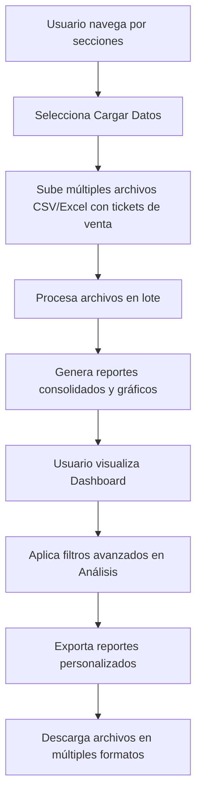

# 🚀 Sistema de Reportes de Ventas - Grano DeO

## 📋 Descripción del Proyecto

Sistema web automatizado para la generación de reportes de ventas diarias de tiendas de abarrotes. Esta solución reduce el tiempo de preparación de reportes de **2 horas a solo 15 minutos**, eliminando errores humanos y automatizando procesos manuales para el sector retail de abarrotes.

## 🎯 Objetivos

- **Automatización completa** del proceso de generación de reportes
- **Reducción del tiempo** de preparación de 2 horas a 15 minutos
- **Eliminación de errores** humanos en el procesamiento de datos
- **Interfaz intuitiva** para cualquier empleado del cliente
- **Exportación flexible** a múltiples formatos (Excel, PDF)
- **Carga múltiple** de archivos para múltiples tiendas

## ✨ Funcionalidades Principales

### 🧭 Navegación Intuitiva
- **Barra de navegación** con secciones organizadas
- **Dashboard principal** con KPIs y gráficos
- **Secciones separadas** para cada funcionalidad
- **Navegación responsive** para dispositivos móviles

### 📤 Carga Múltiple de Archivos
- **Drag & Drop** de múltiples archivos Excel (.xlsx, .xls) y CSV
- **Carga simultánea** para múltiples tiendas
- **Validación automática** de tipos de archivo y tamaño
- **Historial de archivos** cargados con estadísticas
- **Procesamiento en lote** con barra de progreso
- **Soporte** para archivos de hasta 10MB cada uno

### 📊 Generación de Reportes
- **Reportes diarios** de tickets de venta
- **Filtros avanzados** por fecha, tienda y producto
- **KPIs en tiempo real** (ventas totales, productos, tiendas activas)
- **Tabla dinámica** con datos filtrados y ordenados
- **Consolidación automática** de datos de múltiples tiendas

### 📈 Análisis Avanzado Completamente Funcional
- **Dashboard con métricas clave** (KPIs) en tiempo real
- **Filtros avanzados** por rango de fechas, tienda y producto
- **Métricas comparativas** con períodos anteriores
- **Tabla de análisis detallado** con búsqueda y ordenamiento
- **Gráficos interactivos** con Chart.js
- **Múltiples tipos de gráficos** (barras, líneas, donas, pie)
- **Análisis comparativo** entre períodos
- **Proyecciones de ventas** futuras
- **Gráficas con altura limitada** para mejor visualización
- **Exportación directa** de análisis filtrados

### 💾 Exportación Completamente Funcional
- **Exportación a Excel** (formato CSV) con múltiples opciones
- **Exportación a PDF** (en desarrollo)
- **Reportes personalizados** con filtros específicos
- **Configuración avanzada** de exportación
- **Vista previa** de reportes antes de descargar
- **Historial de exportaciones** con seguimiento
- **Múltiples formatos**: Todos los datos, filtrados, resumen por tienda, ventas diarias
- **Descarga automática** de archivos generados

## 🛠️ Tecnologías Utilizadas

- **Frontend**: HTML5, CSS3, JavaScript ES6+
- **Gráficos**: Chart.js para visualizaciones interactivas
- **Estilos**: CSS puro con diseño responsive y moderno
- **Iconos**: Font Awesome 6.0
- **Almacenamiento**: LocalStorage para persistencia local
- **Compatibilidad**: Navegadores modernos (Chrome, Firefox, Safari, Edge)

## 🚀 Instalación y Uso

### Requisitos Previos
- Navegador web moderno
- No requiere instalación de software adicional

### Pasos de Instalación

1. **Clonar o descargar** el proyecto
2. **Abrir** el archivo `index.html` en tu navegador
3. **¡Listo!** La aplicación está funcionando

### Uso Rápido

1. **Navegar** por las diferentes secciones usando la barra superior
2. **Subir múltiples archivos** CSV o Excel en la sección "Cargar Datos"
3. **Procesar archivos** para generar reportes consolidados
4. **Visualizar gráficos** y KPIs en el Dashboard
5. **Analizar datos** con filtros avanzados en la sección Análisis
6. **Exportar reportes** en diferentes formatos según necesidades

## 📁 Estructura del Proyecto

```
Reportes/
├── index.html          # Archivo principal con navegación y secciones
├── styles.css          # Estilos modernos y responsive
├── script.js           # Lógica completa con funcionalidad avanzada
├── README.md           # Documentación del proyecto
└── ejemplo_datos.csv   # Archivo de ejemplo con datos detallados de abarrotes
```

## 🎨 Características del Diseño

### UI/UX Moderno
- **Barra de navegación elegante** con logo personalizado
- **Diseño delgado y limpio** para mejor usabilidad
- **Colores corporativos** (amarillo dorado - Grano DeO)
- **Efectos visuales sutiles** y transiciones suaves
- **Interfaz responsive** para todos los dispositivos

### Navegación por Secciones
- **Dashboard**: Vista general con KPIs y gráficos principales
- **Cargar Datos**: Subida múltiple y procesamiento de archivos
- **Reportes**: Tabla de datos con filtros avanzados
- **Análisis**: Gráficos detallados y comparativas funcionales
- **Exportar**: Descarga de reportes en diferentes formatos

### Gráficos Interactivos
- **Gráfico de dona**: Ventas por tienda
- **Gráfico de barras**: Ventas por producto
- **Gráfico de líneas**: Tendencia de ventas en el tiempo
- **Gráfico de pie**: Distribución por categorías
- **Gráficos comparativos**: Rendimiento entre períodos
- **Proyecciones**: Estimaciones de ventas futuras
- **Altura limitada**: Gráficas con tamaño fijo para mejor visualización

## 🔧 Configuración

### Personalización de Estilos
- Modifica `styles.css` para cambiar colores, fuentes y layout
- Los colores principales están basados en la identidad de Grano DeO
- El diseño es completamente responsive y adaptable
- Las gráficas tienen altura limitada para evitar crecimiento excesivo

### Funcionalidades JavaScript
- Edita `script.js` para modificar la lógica de procesamiento
- Personaliza la generación de datos de ejemplo para abarrotes
- Ajusta los filtros y validaciones según necesidades
- Modifica los gráficos y tipos de visualización
- **Funcionalidad completa** de carga múltiple, análisis y exportación

## 📊 Formato de Datos Esperado

### Estructura del Excel/CSV para Tiendas de Abarrotes
La aplicación espera archivos con las siguientes columnas:

| Columna | Descripción | Tipo | Ejemplo |
|---------|-------------|------|---------|
| Tienda | Nombre de la tienda | Texto | "Tienda Centro" |
| Producto | Nombre del producto | Texto | "Arroz 1kg" |
| Fecha | Fecha de venta | Fecha | "2024-01-15" |
| Cantidad | Cantidad vendida | Número | 2 |
| Precio_Unitario | Precio por unidad | Decimal | 18.50 |
| Total | Total de la venta | Decimal | 37.00 |

### Productos Típicos de Abarrotes Incluidos
- **Alimentos básicos**: Arroz, frijoles, aceite, azúcar, harina
- **Lácteos**: Leche, huevos, pan
- **Bebidas**: Coca Cola, cerveza
- **Snacks**: Papas fritas, galletas
- **Enlatados**: Atún, sopas
- **Café**: Café soluble
- **Limpieza**: Detergente, jabón, pasta dental, shampoo
- **Higiene**: Papel higiénico

### Validaciones
- **Tipos de archivo**: .xlsx, .xls, .csv
- **Tamaño máximo**: 10MB por archivo
- **Formato de fecha**: YYYY-MM-DD
- **Valores numéricos**: Solo números positivos
- **Carga múltiple**: Soporte para varios archivos simultáneos

## 🔄 Flujo de Trabajo



## 🧪 Testing y Datos de Ejemplo

### Datos de Prueba
La aplicación incluye un sistema de generación de datos de ejemplo que:
- Crea **tickets de venta diarios** para los últimos 30 días
- Genera **15-25 tickets por día** por tienda
- Incluye **5 tiendas** diferentes
- Contiene **20 productos** típicos de abarrotes
- Usa **precios realistas** del mercado mexicano
- **Archivo CSV detallado** incluido para testing

### Casos de Prueba
1. **Navegación**: Probar todas las secciones de la aplicación
2. **Carga múltiple**: Subir varios archivos CSV/Excel simultáneamente
3. **Procesamiento**: Verificar procesamiento en lote con barra de progreso
4. **Análisis**: Probar filtros avanzados y métricas comparativas
5. **Exportación**: Exportar reportes en diferentes formatos
6. **Responsive**: Probar en diferentes tamaños de pantalla

## 🚧 Funcionalidades en Desarrollo

- [ ] **Exportación a PDF** con librería jsPDF
- [ ] **Gráficos 3D** para visualizaciones avanzadas
- [ ] **Integración con backend** para procesamiento real
- [ ] **Autenticación de usuarios**
- [ ] **Historial de reportes**
- [ ] **Notificaciones push**

## 🤝 Contribución

### Cómo Contribuir
1. **Fork** del proyecto
2. **Crear rama** para nueva funcionalidad
3. **Commit** de cambios
4. **Push** a la rama
5. **Crear Pull Request**

### Estándares de Código
- **HTML**: Semántico y accesible
- **CSS**: Responsive design, BEM methodology
- **JavaScript**: ES6+, funciones puras, manejo de errores
- **Gráficos**: Chart.js con configuración optimizada y altura limitada
- **Funcionalidad**: Carga múltiple, análisis avanzado y exportación completa

## 📱 Compatibilidad

### Navegadores Soportados
- ✅ Chrome 80+
- ✅ Firefox 75+
- ✅ Safari 13+
- ✅ Edge 80+

### Dispositivos
- ✅ Desktop (Windows, macOS, Linux)
- ✅ Tablet (iOS, Android)
- ✅ Mobile (iOS, Android)

## 🔒 Seguridad

### Características de Seguridad
- **Validación de archivos** en el frontend
- **Sanitización de datos** antes del procesamiento
- **Límites de tamaño** para prevenir ataques DoS
- **Almacenamiento local** sin enví a servidores externos
- **Validación de tipos** de archivo y contenido

## 📈 Roadmap

### Versión 1.2 (Actual)
- ✅ Carga múltiple de archivos
- ✅ Análisis avanzado completamente funcional
- ✅ Exportación en múltiples formatos
- ✅ Filtros avanzados y métricas comparativas

### Versión 1.3 (Próxima)
- [ ] Exportación a PDF
- [ ] Gráficos 3D y animaciones
- [ ] Filtros avanzados con búsqueda semántica

### Versión 2.0
- [ ] Integración con APIs externas
- [ ] Sistema de plantillas personalizables
- [ ] Reportes programados automáticos

## 🆘 Soporte y Contacto

### Problemas Comunes
1. **Archivo no se procesa**: Verificar formato y tamaño
2. **Gráficos no se muestran**: Verificar que Chart.js esté cargado
3. **Gráficas crecen demasiado**: Verificar que CSS esté aplicado correctamente
4. **Filtros no funcionan**: Asegurar fechas válidas
5. **Exportación falla**: Verificar permisos de descarga
6. **Carga múltiple**: Verificar que los archivos sean del formato correcto

### Contacto
- **Empresa**: Grano DeO
- **Proyecto**: Sistema de Reportes de Ventas para Abarrotes
- **Versión**: 1.2.0

## 📄 Licencia

Este proyecto es propiedad de **Grano DeO** y está destinado para uso interno de la empresa.

---

## 🎉 ¡Gracias por usar nuestro Sistema de Reportes!

**Grano DeO** - Transformando la gestión de datos en retail de abarrotes
